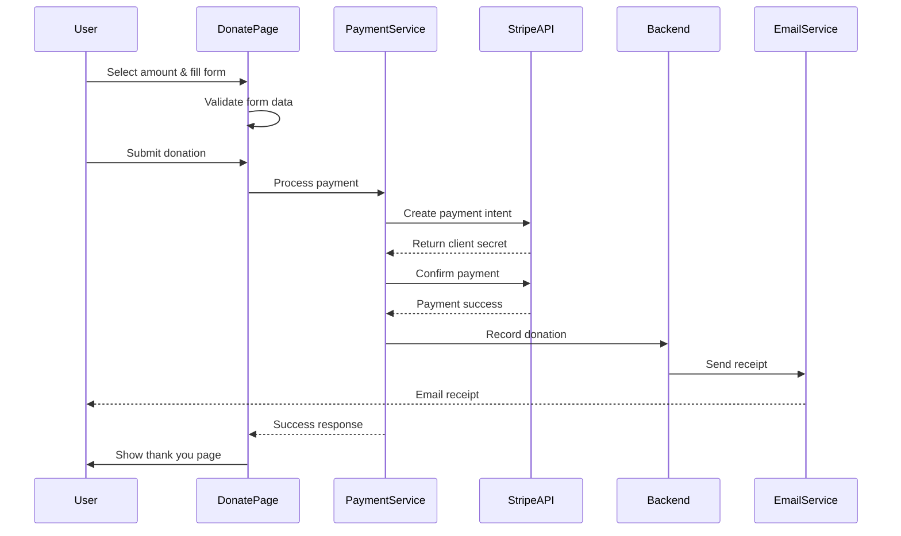

# Design Document

## Overview

The donate page will be a comprehensive, conversion-optimized page that enables alumni to contribute financially to support fellow alumni, scholarships, and programs. The design follows the existing application patterns using Material-UI components, React, and Redux for state management. The page will integrate with payment processing services (Stripe recommended) to handle secure transactions while maintaining a clean, trustworthy, and accessible user experience.

The page architecture emphasizes simplicity, trust, and mobile-first design principles. It will feature a hero section with compelling messaging, a flexible donation form with preset and custom amounts, secure payment processing, immediate confirmation, and optional donor recognition features.

## Architecture

### Component Structure

```
DonatePage (Main Container)
├── HeroSection
│   ├── Headline & Purpose Statement
│   ├── Impact Statistics
│   └── Trust Badges
├── DonationCategoriesSection
│   ├── CategoryCard (Fellow Alumni in Need)
│   ├── CategoryCard (Scholarships)
│   └── CategoryCard (Alumni Programs)
├── DonationFormSection
│   ├── DonationTypeSelector (One-time/Recurring)
│   ├── AmountSelector
│   │   ├── PresetAmountButtons
│   │   └── CustomAmountInput
│   ├── DonorInformationForm
│   │   ├── NameField (pre-filled if logged in)
│   │   ├── EmailField (pre-filled if logged in)
│   │   └── DonationCategorySelector
│   └── PaymentMethodSelector
├── ImpactStoriesSection
│   └── ImpactStoryCard[]
├── DonorRecognitionSection
│   ├── DonorWall
│   └── RecognitionOptIn
├── TrustSignalsSection
│   ├── SecurityBadges
│   ├── PrivacyStatement
│   └── TaxInformation
└── FAQSection
```

### Payment Processing Flow



### State Management

The donate page will use Redux for managing:
- Donation form state (amount, type, category)
- Payment processing status
- User information (if authenticated)
- Donation history (for logged-in users)

Local component state will handle:
- Form validation errors
- UI interactions (expanded sections, tooltips)
- Payment method selection

## Components and Interfaces

### 1. DonatePage Component

Main container component that orchestrates all sections.

**Props:** None (uses Redux for state)

**State:**
```javascript
{
  donationType: 'one-time' | 'recurring',
  amount: number,
  customAmount: string,
  selectedCategory: 'all' | 'alumni-support' | 'scholarships' | 'programs',
  donorInfo: {
    name: string,
    email: string,
    displayName: string | null,
    optInRecognition: boolean,
    optInUpdates: boolean
  },
  paymentMethod: 'card' | 'paypal',
  isProcessing: boolean,
  error: string | null
}
```

### 2. HeroSection Component

Displays compelling headline, purpose statement, and trust signals.

**Design:**
- Full-width section with gradient background
- Centered content with max-width container
- Large, bold headline explaining donation purpose
- Subheading with impact statistics
- Trust badges (secure payment, tax-deductible, etc.)

**Responsive Behavior:**
- Mobile: Stack elements vertically, reduce font sizes
- Tablet/Desktop: Horizontal layout with statistics in a row

### 3. DonationCategoriesSection Component

Shows three category cards explaining where donations go.

**Props:**
```javascript
{
  onCategorySelect: (category: string) => void,
  selectedCategory: string
}
```

**Design:**
- Three equal-width cards in a grid
- Each card has icon, title, description
- Hover effect with elevation change
- Selected state with border highlight
- Optional: Progress bars showing funding goals

**Responsive Behavior:**
- Mobile: Single column stack
- Tablet: 2 columns
- Desktop: 3 columns

### 4. DonationFormSection Component

Core donation form with amount selection and donor information.

**Sub-components:**

#### AmountSelector
```javascript
{
  presetAmounts: [25, 50, 100, 250, 500],
  selectedAmount: number | null,
  customAmount: string,
  onAmountSelect: (amount: number) => void,
  onCustomAmountChange: (amount: string) => void
}
```

**Design:**
- Toggle buttons for one-time vs recurring
- Grid of preset amount buttons
- Custom amount input field
- Visual feedback for selected amount
- Validation for custom amounts

#### DonorInformationForm
```javascript
{
  name: string,
  email: string,
  category: string,
  errors: object,
  onChange: (field: string, value: any) => void
}
```

**Design:**
- Clean, minimal form fields
- Pre-filled if user is logged in
- Inline validation with error messages
- Proper labels and ARIA attributes
- Category dropdown/selector

### 5. PaymentMethodSelector Component

Allows users to choose payment method and enter payment details.

**Props:**
```javascript
{
  selectedMethod: 'card' | 'paypal',
  onMethodChange: (method: string) => void,
  onPaymentComplete: (paymentData: object) => void
}
```

**Design:**
- Radio buttons or tabs for payment method selection
- Stripe Elements integration for card payments
- PayPal button integration
- Security badges and SSL indicators
- Clear error messaging

**Integration:**
- Uses Stripe.js for PCI-compliant card handling
- PayPal SDK for PayPal payments
- No sensitive data stored in application state

### 6. ImpactStoriesSection Component

Displays testimonials and stories showing donation impact.

**Props:**
```javascript
{
  stories: Array<{
    id: string,
    title: string,
    description: string,
    image?: string,
    category: string,
    date: string
  }>
}
```

**Design:**
- Carousel or grid of story cards
- Each card has image, title, excerpt
- "Read more" link to full stories
- Category tags
- Emotional, compelling content

**Responsive Behavior:**
- Mobile: Single column, swipeable carousel
- Tablet/Desktop: 2-3 column grid

### 7. DonorRecognitionSection Component

Shows donor wall and opt-in options.

**Props:**
```javascript
{
  recentDonors: Array<{
    displayName: string,
    amount?: number,
    date: string,
    level?: string
  }>,
  onOptInChange: (optIn: boolean) => void
}
```

**Design:**
- Donor wall with recent contributors
- Donation level badges (Bronze, Silver, Gold, etc.)
- Privacy-respecting display options
- Checkbox for opt-in during donation
- Anonymous option clearly available

### 8. TrustSignalsSection Component

Displays security, privacy, and tax information.

**Design:**
- Security badges (SSL, PCI compliance)
- Privacy policy link
- Tax-deductible information
- Organization credentials
- Financial transparency links

### 9. ThankYouModal Component

Shown after successful donation.

**Props:**
```javascript
{
  open: boolean,
  donationData: {
    amount: number,
    transactionId: string,
    date: string,
    category: string
  },
  onClose: () => void,
  onDownloadReceipt: () => void
}
```

**Design:**
- Modal overlay with celebration animation
- Thank you message
- Donation summary
- Download receipt button
- Social sharing options
- Option to make another donation

## Data Models

### Donation Model

```javascript
{
  id: string,
  userId: string | null, // null for guest donations
  amount: number,
  currency: string, // default: 'USD'
  type: 'one-time' | 'recurring',
  frequency: 'monthly' | 'quarterly' | 'annually' | null,
  category: 'all' | 'alumni-support' | 'scholarships' | 'programs',
  donorInfo: {
    name: string,
    email: string,
    displayName: string | null,
    optInRecognition: boolean,
    optInUpdates: boolean
  },
  paymentMethod: 'card' | 'paypal',
  transactionId: string,
  status: 'pending' | 'completed' | 'failed' | 'refunded',
  receiptUrl: string | null,
  createdAt: timestamp,
  updatedAt: timestamp
}
```

### DonationCategory Model

```javascript
{
  id: string,
  name: string,
  slug: string,
  description: string,
  icon: string,
  goalAmount: number | null,
  currentAmount: number,
  isActive: boolean
}
```

### ImpactStory Model

```javascript
{
  id: string,
  title: string,
  content: string,
  excerpt: string,
  image: string | null,
  category: string,
  author: string | null,
  publishedAt: timestamp,
  isPublished: boolean
}
```

### DonorRecognition Model

```javascript
{
  id: string,
  donationId: string,
  displayName: string,
  amount: number | null, // null if donor wants to hide amount
  level: 'bronze' | 'silver' | 'gold' | 'platinum',
  isAnonymous: boolean,
  createdAt: timestamp
}
```

## Error Handling

### Validation Errors

**Client-side validation:**
- Amount validation (minimum $1, maximum $10,000 for one-time)
- Email format validation
- Required field validation
- Custom amount numeric validation

**Error Display:**
- Inline errors below form fields
- Red border on invalid fields
- Clear, actionable error messages
- Focus management to first error

### Payment Errors

**Common scenarios:**
- Card declined
- Insufficient funds
- Network timeout
- Invalid card details
- 3D Secure authentication failure

**Error Handling:**
- User-friendly error messages
- Retry option
- Alternative payment method suggestion
- Support contact information
- Error logging for admin review

### API Errors

**Scenarios:**
- Backend service unavailable
- Database connection failure
- Email service failure
- Payment gateway timeout

**Handling:**
- Graceful degradation
- Retry mechanism with exponential backoff
- Fallback to email support
- Transaction state preservation
- Admin notification for critical failures

## Testing Strategy

### Unit Tests

**Components to test:**
- AmountSelector: Amount selection and validation
- DonorInformationForm: Form validation and submission
- PaymentMethodSelector: Payment method switching
- ThankYouModal: Display and actions

**Test cases:**
- Preset amount selection
- Custom amount validation
- Form field validation
- Error message display
- Accessibility attributes
- Responsive behavior

### Integration Tests

**Flows to test:**
- Complete donation flow (one-time)
- Complete donation flow (recurring)
- Guest donation (not logged in)
- Authenticated user donation (pre-filled)
- Payment failure and retry
- Form abandonment and recovery

### End-to-End Tests

**Critical paths:**
1. User lands on donate page → selects amount → fills form → completes payment → sees thank you
2. User starts donation → encounters error → retries → succeeds
3. Logged-in user donates → donation appears in profile
4. Recurring donation setup → confirmation email sent

### Accessibility Tests

**WCAG 2.1 Level AA compliance:**
- Keyboard navigation through entire form
- Screen reader compatibility
- Color contrast ratios
- Focus indicators
- ARIA labels and roles
- Form error announcements
- Skip links and landmarks

**Tools:**
- axe DevTools
- WAVE browser extension
- Manual keyboard testing
- Screen reader testing (NVDA, JAWS, VoiceOver)

### Performance Tests

**Metrics:**
- Page load time < 3s on 3G
- Time to interactive < 5s
- First contentful paint < 2s
- Payment form submission < 2s

**Optimization:**
- Lazy load impact stories
- Optimize images
- Code splitting for payment libraries
- Minimize bundle size

## Design Specifications

### Color Palette

Following the existing Material-UI theme:
- Primary: Theme primary color (for CTAs, buttons)
- Secondary: Theme secondary color (for accents)
- Success: Green (#4caf50) for successful donations
- Error: Red (#f44336) for validation errors
- Warning: Orange (#ff9800) for important notices
- Background: White/Light gray for sections
- Text: Dark gray for body text, black for headings

### Typography

Using Material-UI typography system:
- Hero headline: h2 (3rem on desktop, 2rem on mobile)
- Section headings: h3 (2.5rem on desktop, 1.75rem on mobile)
- Card titles: h5 (1.5rem)
- Body text: body1 (1rem)
- Small text: body2 (0.875rem)
- Button text: button (0.875rem, uppercase)

### Spacing

Following 8px grid system:
- Section padding: 64px vertical (mobile: 32px)
- Card padding: 24px (mobile: 16px)
- Form field spacing: 16px
- Button padding: 12px 24px
- Grid gaps: 24px (mobile: 16px)

### Breakpoints

Material-UI default breakpoints:
- xs: 0px (mobile)
- sm: 600px (tablet)
- md: 960px (small desktop)
- lg: 1280px (desktop)
- xl: 1920px (large desktop)

### Interactive Elements

**Buttons:**
- Primary CTA: Contained button, primary color
- Secondary actions: Outlined button
- Tertiary actions: Text button
- Minimum touch target: 44x44px
- Hover: Slight elevation increase
- Active: Slight scale down (0.98)
- Disabled: 50% opacity

**Form Fields:**
- Border: 1px solid gray
- Focus: 2px solid primary color
- Error: 2px solid error color
- Border radius: 4px
- Label: Floating label pattern
- Helper text: Below field, small font

**Cards:**
- Border radius: 8px
- Elevation: 2 (hover: 4)
- Padding: 24px
- Transition: 0.3s ease

### Animations

**Page transitions:**
- Fade in on mount: 0.5s
- Scroll animations: Fade up on scroll into view

**Form interactions:**
- Button click: Scale down 0.98
- Success: Checkmark animation
- Error shake: Horizontal shake 0.3s

**Payment processing:**
- Loading spinner during processing
- Success confetti animation
- Progress indicator for multi-step

### Mobile Optimizations

**Touch targets:**
- Minimum 44x44px for all interactive elements
- Increased spacing between buttons
- Larger form fields

**Layout:**
- Single column on mobile
- Sticky donate button at bottom
- Collapsible sections for long content
- Swipeable carousels

**Performance:**
- Lazy load images
- Defer non-critical JavaScript
- Optimize font loading
- Minimize initial bundle

### Accessibility Features

**Keyboard Navigation:**
- Logical tab order
- Visible focus indicators
- Skip to main content link
- Escape to close modals

**Screen Readers:**
- Semantic HTML (header, main, section, article)
- ARIA labels for icons
- ARIA live regions for dynamic content
- Form field associations (label + input)

**Visual:**
- 4.5:1 contrast ratio for text
- 3:1 contrast ratio for UI components
- No color-only information
- Scalable text (up to 200%)

**Forms:**
- Clear labels
- Error identification
- Error suggestions
- Success confirmation

## Technical Implementation Details

### Payment Integration

**Stripe Integration:**

1. **Setup:**
   - Install `@stripe/stripe-js` and `@stripe/react-stripe-js`
   - Configure Stripe publishable key in environment variables
   - Create Stripe Elements wrapper component

2. **Payment Flow:**
   ```javascript
   // Client-side
   const stripe = await loadStripe(process.env.REACT_APP_STRIPE_KEY);
   const { error, paymentIntent } = await stripe.confirmCardPayment(
     clientSecret,
     { payment_method: { card: cardElement } }
   );
   ```

3. **Backend Requirements:**
   - Create payment intent endpoint: `POST /api/donations/create-intent`
   - Confirm payment endpoint: `POST /api/donations/confirm`
   - Webhook handler for payment events: `POST /api/webhooks/stripe`

**PayPal Integration:**

1. **Setup:**
   - Install `@paypal/react-paypal-js`
   - Configure PayPal client ID
   - Create PayPal button component

2. **Payment Flow:**
   ```javascript
   <PayPalButtons
     createOrder={(data, actions) => {
       return actions.order.create({
         purchase_units: [{ amount: { value: amount } }]
       });
     }}
     onApprove={(data, actions) => {
       return actions.order.capture().then(handleSuccess);
     }}
   />
   ```

### State Management

**Redux Slice: donationSlice.js**

```javascript
const donationSlice = createSlice({
  name: 'donation',
  initialState: {
    formData: {
      type: 'one-time',
      amount: null,
      category: 'all',
      donorInfo: {}
    },
    processing: false,
    error: null,
    success: false,
    transactionId: null
  },
  reducers: {
    updateFormData,
    startProcessing,
    processingSuccess,
    processingError,
    resetDonation
  }
});
```

### API Endpoints

**Frontend Service: donationService.js**

```javascript
// Create donation intent
POST /api/donations/create-intent
Body: { amount, currency, type, category }
Response: { clientSecret, donationId }

// Confirm donation
POST /api/donations/confirm
Body: { donationId, paymentIntentId, donorInfo }
Response: { success, transactionId, receiptUrl }

// Get donation categories
GET /api/donations/categories
Response: { categories: [...] }

// Get impact stories
GET /api/donations/impact-stories
Response: { stories: [...] }

// Get donor wall
GET /api/donations/donor-wall
Response: { donors: [...] }

// Download receipt
GET /api/donations/receipt/:transactionId
Response: PDF file
```

### Analytics Integration

**Events to Track:**

1. Page views: `donate_page_view`
2. Form interactions:
   - `amount_selected`
   - `donation_type_changed`
   - `category_selected`
   - `payment_method_selected`
3. Form submission: `donation_initiated`
4. Payment success: `donation_completed`
5. Payment failure: `donation_failed`
6. Form abandonment: `donation_abandoned`
7. Receipt download: `receipt_downloaded`

**Implementation:**

```javascript
// Using Google Analytics or similar
const trackEvent = (eventName, eventData) => {
  if (window.gtag) {
    window.gtag('event', eventName, eventData);
  }
};

// Example usage
trackEvent('donation_completed', {
  amount: donationAmount,
  category: selectedCategory,
  type: donationType,
  payment_method: paymentMethod
});
```

### Email Templates

**Receipt Email:**
- Transaction ID
- Donation amount
- Date and time
- Category
- Tax-deductible information
- PDF receipt attachment
- Thank you message

**Recurring Donation Confirmation:**
- Subscription details
- Next charge date
- Cancellation instructions
- Manage subscription link

**Impact Update Email:**
- Stories of how donations helped
- Statistics and metrics
- Call to action for additional support
- Unsubscribe option

### Security Considerations

1. **PCI Compliance:**
   - Never store card details
   - Use Stripe Elements for card input
   - HTTPS only
   - Secure token handling

2. **Data Protection:**
   - Encrypt sensitive data at rest
   - Secure API endpoints with authentication
   - Rate limiting on donation endpoints
   - CSRF protection

3. **Fraud Prevention:**
   - Captcha for guest donations
   - Maximum donation limits
   - Velocity checks
   - IP-based rate limiting

4. **Privacy:**
   - GDPR compliance
   - Clear privacy policy
   - Opt-in for communications
   - Data retention policies
   - Right to be forgotten

### Performance Optimization

1. **Code Splitting:**
   ```javascript
   const PaymentForm = lazy(() => import('./PaymentForm'));
   ```

2. **Image Optimization:**
   - WebP format with fallbacks
   - Responsive images
   - Lazy loading
   - CDN delivery

3. **Bundle Optimization:**
   - Tree shaking
   - Minimize dependencies
   - Dynamic imports for payment libraries
   - Compression (gzip/brotli)

4. **Caching:**
   - Cache donation categories
   - Cache impact stories
   - Service worker for offline support
   - CDN caching for static assets

## Current Implementation Analysis

The existing DonationPage (`frontend/src/pages/donations/DonationPage.js`) provides a basic foundation with:

**Existing Features:**
- Campaign-based donation system
- Preset donation amounts
- Payment method selection
- Recent donations list
- Progress tracking for campaigns

**Gaps to Address:**
1. No clear messaging about supporting alumni in need, scholarships, and programs
2. Limited mobile optimization
3. No actual payment integration (Stripe/PayPal)
4. Missing donor recognition features
5. No impact stories section
6. Limited trust signals and security badges
7. No recurring donation support
8. Missing accessibility features
9. No analytics integration
10. No receipt generation or email confirmation
11. Form doesn't pre-fill for logged-in users
12. No donor wall or engagement features

**Recommended Approach:**
Rather than starting from scratch, we'll enhance the existing page by:
1. Restructuring the layout to be more conversion-focused
2. Adding clear purpose messaging at the top
3. Replacing campaign-based model with category-based donations
4. Integrating real payment processing
5. Adding all missing features from requirements
6. Improving mobile responsiveness
7. Implementing full accessibility compliance

## Migration Strategy

**Phase 1: Layout and Messaging**
- Add hero section with clear purpose
- Replace campaigns with donation categories
- Improve visual hierarchy

**Phase 2: Form Enhancement**
- Add one-time/recurring toggle
- Improve amount selection UX
- Pre-fill user information
- Add custom amount validation

**Phase 3: Payment Integration**
- Integrate Stripe for card payments
- Add PayPal button
- Implement secure payment flow

**Phase 4: Trust and Engagement**
- Add trust signals section
- Implement donor wall
- Add impact stories
- Create thank you modal

**Phase 5: Polish and Optimization**
- Mobile optimization
- Accessibility audit and fixes
- Analytics integration
- Performance optimization
