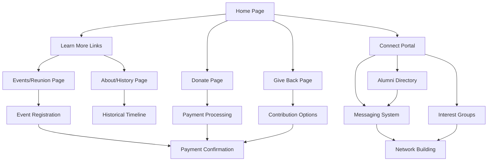

# PSDAHS Alumni Website - Complete Product Requirements Document

## 1. Product Overview

The PSDAHS Alumni website is a comprehensive digital platform designed to connect alumni, facilitate donations, and showcase the school's rich history and achievements. This document outlines the implementation of key features including enhanced navigation, secure payment processing, historical content presentation, and community engagement tools.

The platform serves current students, alumni, faculty, and potential donors by providing seamless access to events, donation opportunities, historical information, and networking capabilities. The target market includes the broader PSDAHS community both locally and internationally.

## 2. Core Features

### 2.1 User Roles

| Role | Registration Method | Core Permissions |
|------|---------------------|------------------|
| Alumni | Email registration with graduation verification | Full profile access, networking, event participation |
| Student | Current enrollment verification | Limited profile access, event viewing |
| Faculty/Staff | Administrative verification | Content management, user oversight |
| Donor | Guest checkout or registered account | Donation processing, recognition features |
| Admin | Backend assignment | Full system administration |

### 2.2 Feature Module

Our comprehensive alumni platform requirements consist of the following main pages:

1. **Home page**: Hero section, navigation, learn more buttons for each section, event highlights
2. **Donate page**: Payment method selection, secure processing, donation forms, success confirmation
3. **About/History page**: Timeline visualization, founding story, achievements, historical gallery
4. **Give Back page**: Multiple contribution options, impact stories, volunteer opportunities
5. **Connect page**: Alumni directory, messaging system, interest groups, networking tools
6. **Events/Reunion page**: Annual reunion details, registration, event information
7. **Login/Register pages**: User authentication, profile creation, verification

### 2.3 Page Details

| Page Name | Module Name | Feature description |
|-----------|-------------|---------------------|
| Home page | Learn More Links | Implement clickable buttons for Annual Alumni Reunion (→ /events/reunion) and other sections with hover effects and click tracking |
| Home page | Navigation | Responsive menu with mobile optimization, clear visual hierarchy |
| Donate page | Payment Methods | Remove recurring options, add Credit Card (Visa/Mastercard/Amex), Liberia Mobile Money, Orange Money with provider logos |
| Donate page | Payment Processing | PCI compliant credit card handling, step-by-step instructions, field validation, success/error messaging |
| About/History | Timeline Visualization | Modern responsive layout with timeline of key milestones, founding story, achievements, historical photos |
| About/History | Content Sections | Dedicated sections for founding story, notable alumni, historical documents with high-quality images |
| Give Back | Contribution Options | Multiple giving methods (donations, volunteering, mentorship), impact stories, clear CTAs |
| Give Back | Integration | Seamless connection with existing donation system, user-friendly interface |
| Connect | Alumni Directory | Searchable directory with filters, privacy controls, profile management |
| Connect | Messaging System | Secure messaging between alumni, conversation history, notification system |
| Connect | Interest Groups | Create/join groups based on interests, activities, graduation years |
| Connect | Event Networking | Tools for connecting at events, attendee lists, networking features |
| Events/Reunion | Event Details | Comprehensive reunion information, schedule, location, registration |
| Events/Reunion | Registration | Online registration system, payment processing, confirmation emails |

## 3. Core Process

### User Flow - Alumni Engagement Journey

**Visitor Flow:**
1. Visitor lands on Home page → Views hero section and learn more links
2. Clicks "Learn More" on Annual Alumni Reunion → Redirects to /events/reunion
3. Explores donation options → Clicks "Give Back" or "Donate" → Completes secure payment
4. Views historical content → Navigates to /about/history → Explores timeline and achievements
5. Decides to connect → Registers account → Accesses /connect portal

**Registered Alumni Flow:**
1. Alumni logs in → Accesses full platform features
2. Uses Connect portal → Searches directory → Joins interest groups
3. Messages other alumni → Participates in discussions
4. Registers for events → Makes donations → Shares experiences

## 4. User Interface Design

### 4.1 Design Style

**Color Palette:**
- Primary: Deep blue (#1e3a8a) - represents trust and professionalism
- Secondary: Gold (#f59e0b) - represents achievement and excellence
- Accent: White (#ffffff) - for clean, modern appearance
- Text: Dark gray (#374151) - for optimal readability

**Typography:**
- Headers: Bold, modern sans-serif (Inter or similar)
- Body text: Clean, readable font (16px base size)
- Mobile: Scaled appropriately (14px minimum)

**Button Style:**
- Rounded corners (8px radius) for modern appearance
- Consistent padding (12px 24px)
- Hover states with smooth transitions (0.3s)
- Clear visual feedback on interaction

**Layout:**
- Card-based design for content organization
- Responsive grid system (12-column)
- Consistent spacing (8px baseline grid)
- Mobile-first approach with progressive enhancement

### 4.2 Page Design Overview

| Page Name | Module Name | UI Elements |
|-----------|-------------|-------------|
| Home page | Learn More Buttons | Rounded gold buttons with hover effects, smooth transitions, click animations |
| Donate page | Payment Methods | Card-based layout with provider logos, secure badges, step indicators |
| About/History | Timeline | Vertical timeline with milestone cards, historical images, responsive layout |
| Give Back | Contribution Cards | Grid layout with option cards, impact story carousel, CTA buttons |
| Connect | Directory Search | Search bar with filters, profile cards, messaging interface |

### 4.3 Responsiveness

- **Desktop-first design** with mobile optimization
- **Breakpoints:** 320px (mobile), 768px (tablet), 1024px (desktop), 1440px (large)
- **Touch optimization:** Larger tap targets (44px minimum), swipe gestures for carousels
- **Performance:** Lazy loading for images, optimized assets, fast loading times
- **Accessibility:** WCAG 2.1 AA compliance, keyboard navigation, screen reader support

## 5. Technical Requirements

### 5.1 Security Requirements

**Payment Security:**
- PCI DSS compliance for credit card processing
- SSL/TLS encryption for all payment data
- Token-based payment processing (no card data storage)
- Secure API integration with payment providers

**Data Protection:**
- GDPR compliance for user data
- Secure user authentication (JWT tokens)
- Encrypted data transmission
- Regular security audits

### 5.2 Performance Requirements

**Loading Speed:**
- Page load time < 3 seconds on 3G
- Image optimization (WebP format, responsive images)
- Code splitting and lazy loading
- CDN integration for static assets

**Scalability:**
- Handle 1000+ concurrent users
- Efficient database queries with indexing
- Caching strategies for frequently accessed data
- Horizontal scaling capability

### 5.3 Integration Requirements

**Payment Providers:**
- Stripe for credit card processing
- Local mobile money APIs (Liberia Mobile Money, Orange Money)
- Webhook integration for payment confirmations
- Sandbox testing environments

**External Services:**
- Email service for notifications
- Analytics platform for tracking
- Social media integration
- Calendar systems for events

## 6. Acceptance Criteria

### 6.1 Home Page Learn More Links

- [ ] All "Learn More" buttons are clickable and navigate to correct pages
- [ ] Annual Alumni Reunion button specifically links to /events/reunion
- [ ] Hover effects are smooth and provide clear visual feedback
- [ ] Click tracking is implemented and data is collectable
- [ ] Links work consistently across all devices and browsers
- [ ] Mobile touch targets are appropriately sized

### 6.2 Donate Page Modifications

- [ ] All recurring donation options are completely removed
- [ ] Credit card processing is PCI compliant and secure
- [ ] Liberia Mobile Money integration includes proper branding
- [ ] Orange Money integration includes provider logos
- [ ] All payment methods have clear step-by-step instructions
- [ ] Field validation works correctly for all payment types
- [ ] Success and error messages are user-friendly
- [ ] Payment flows are tested and working properly

### 6.3 About Us History Section

- [ ] Dedicated /about/history page is created and accessible
- [ ] Timeline visualization is responsive and visually appealing
- [ ] Historical content includes founding story and key achievements
- [ ] High-quality images are properly optimized and displayed
- [ ] Page layout is modern with proper whitespace
- [ ] Content is accessible and readable on all devices

### 6.4 Give Back Functionality

- [ ] Dedicated /give-back page is created with comprehensive content
- [ ] Multiple giving options are clearly presented
- [ ] Impact stories and testimonials are included
- [ ] Integration with existing donation system works seamlessly
- [ ] Clear calls-to-action guide users effectively
- [ ] Page is responsive and mobile-optimized

### 6.5 Connect With Alumni Feature

- [ ] Dedicated /connect portal is accessible and functional
- [ ] Alumni directory is searchable with effective filters
- [ ] Messaging system allows secure communication
- [ ] Interest-based groups can be created and joined
- [ ] Privacy controls are implemented and working
- [ ] Activity feed shows relevant updates
- [ ] All features are mobile-responsive and accessible
- [ ] Performance is optimized for smooth user experience

## 7. Success Metrics

**User Engagement:**
- Click-through rate on "Learn More" buttons > 15%
- Average session duration > 3 minutes
- User registration completion rate > 70%
- Alumni directory search usage > 50% of registered users

**Payment Processing:**
- Payment completion rate > 85%
- Payment processing time < 30 seconds
- Zero security breaches or compliance issues
- User satisfaction with payment experience > 4.5/5

**Content Engagement:**
- History page average time on page > 2 minutes
- Historical photo gallery interaction rate > 40%
- Content sharing rate > 10%
- Return visitor rate > 30%

This comprehensive document serves as the single source of truth for implementing all requested features, ensuring a high-quality, secure, and user-friendly alumni platform that meets the needs of the PSDAHS community.