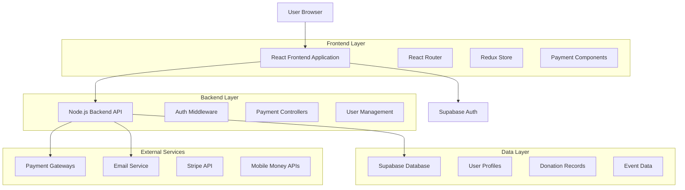
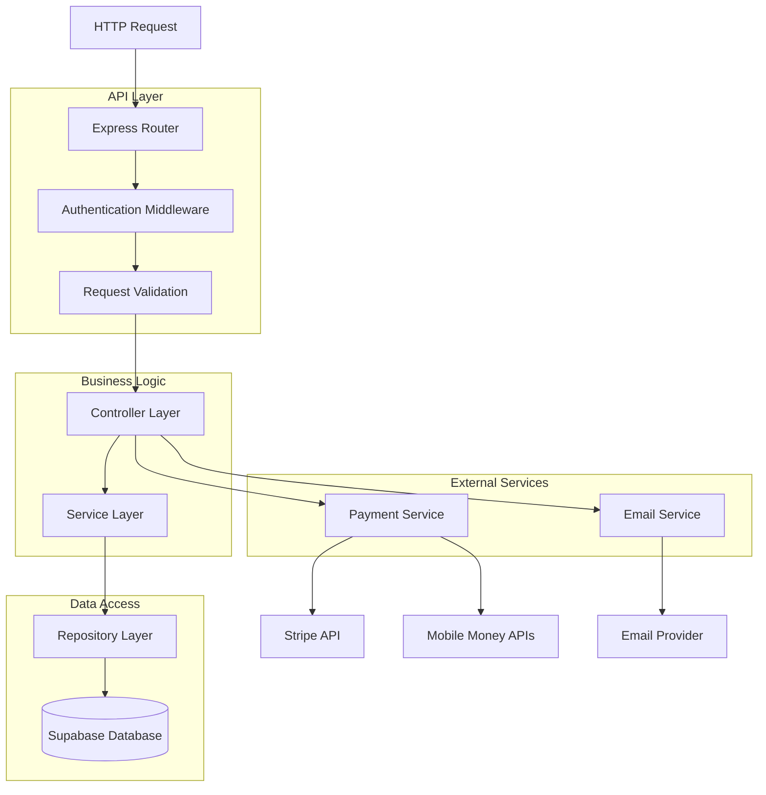
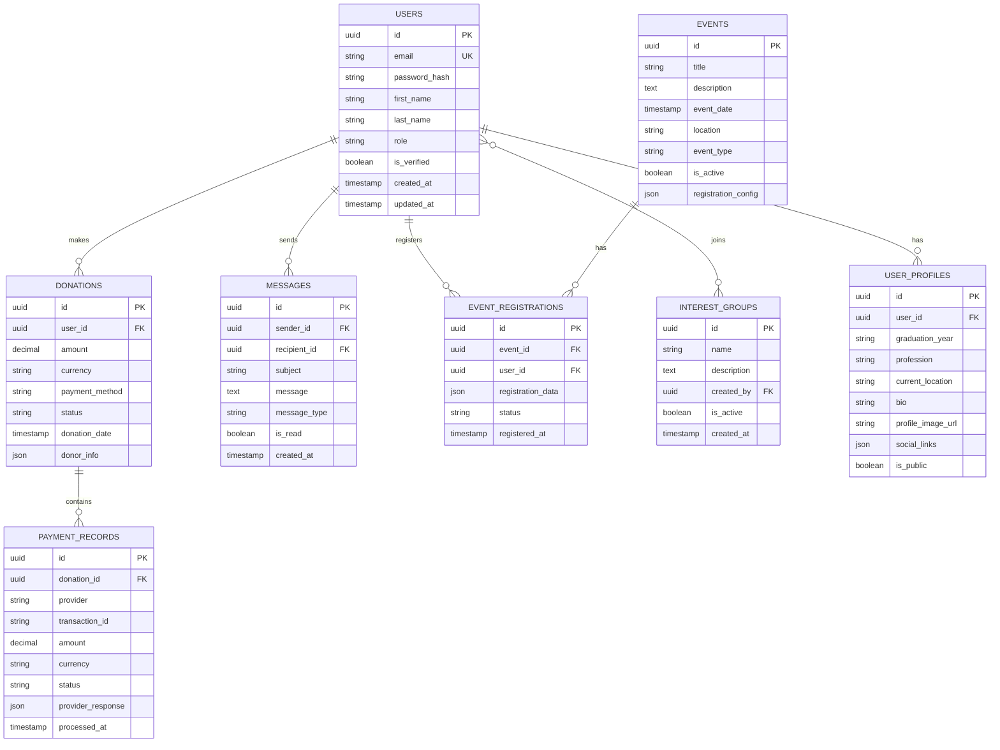

# PSDAHS Alumni Website - Technical Architecture Document

## 1. Architecture Design



## 2. Technology Description

**Frontend Stack:**
- React@18 with functional components and hooks
- TailwindCSS@3 for responsive styling
- Vite for build tooling and development
- React Router@6 for client-side routing
- Redux Toolkit for state management
- Axios for API communication

**Backend Stack:**
- Node.js@18 with Express@4 framework
- Supabase for database and authentication
- JWT for secure token-based authentication
- Bcrypt for password hashing
- Multer for file uploads

**Payment Integration:**
- Stripe SDK for credit card processing
- Custom APIs for Liberia Mobile Money
- Custom APIs for Orange Money
- Webhook handlers for payment confirmations

**Development Tools:**
- ESLint for code quality
- Prettier for code formatting
- Jest for testing framework
- React Testing Library for component testing

## 3. Route Definitions

| Route | Purpose | Authentication |
|-------|---------|----------------|
| / | Home page with learn more links | Public |
| /donate | Donation page with payment methods | Public |
| /about/history | Historical timeline and content | Public |
| /give-back | Contribution options page | Public |
| /connect | Alumni networking portal | Required |
| /events/reunion | Annual reunion details | Public |
| /login | User authentication | Public |
| /register | New user registration | Public |
| /profile | User profile management | Required |
| /admin/* | Administrative functions | Admin only |

## 4. API Definitions

### 4.1 Authentication APIs

**User Registration:**
```
POST /api/auth/register
```

Request:
```json
{
  "email": "alumni@example.com",
  "password": "securePassword123",
  "firstName": "John",
  "lastName": "Doe",
  "graduationYear": 2010,
  "phoneNumber": "+2315551234"
}
```

Response:
```json
{
  "success": true,
  "userId": "uuid-here",
  "token": "jwt-token-here",
  "message": "Registration successful"
}
```

**User Login:**
```
POST /api/auth/login
```

Request:
```json
{
  "email": "alumni@example.com",
  "password": "securePassword123"
}
```

### 4.2 Payment APIs

**Process Donation:**
```
POST /api/donations/process
```

Request:
```json
{
  "amount": 100.00,
  "currency": "USD",
  "paymentMethod": "stripe",
  "donorInfo": {
    "name": "John Doe",
    "email": "john@example.com",
    "phone": "+2315551234"
  },
  "paymentDetails": {
    "cardToken": "tok_visa_1234",
    "billingAddress": {
      "line1": "123 Main St",
      "city": "Monrovia",
      "country": "Liberia"
    }
  }
}
```

**Mobile Money Payment:**
```
POST /api/donations/mobile-money
```

Request:
```json
{
  "amount": 50.00,
  "currency": "LRD",
  "provider": "liberia-mobile-money",
  "phoneNumber": "+2315551234",
  "donorName": "John Doe"
}
```

### 4.3 Alumni Directory APIs

**Search Alumni:**
```
GET /api/alumni/search?query=john&year=2010&location=monrovia
```

Response:
```json
{
  "results": [
    {
      "id": "uuid-1",
      "name": "John Doe",
      "graduationYear": 2010,
      "currentLocation": "Monrovia",
      "profession": "Software Engineer",
      "profileImage": "https://...",
      "isConnectable": true
    }
  ],
  "total": 1,
  "page": 1,
  "limit": 20
}
```

**Send Message:**
```
POST /api/alumni/message
```

Request:
```json
{
  "recipientId": "uuid-recipient",
  "subject": "Hello from fellow alumni",
  "message": "Would love to connect and share experiences...",
  "messageType": "connection_request"
}
```

## 5. Server Architecture Diagram



## 6. Data Model

### 6.1 Database Schema Design



### 6.2 Data Definition Language

**Users Table:**
```sql
CREATE TABLE users (
    id UUID PRIMARY KEY DEFAULT gen_random_uuid(),
    email VARCHAR(255) UNIQUE NOT NULL,
    password_hash VARCHAR(255) NOT NULL,
    first_name VARCHAR(100) NOT NULL,
    last_name VARCHAR(100) NOT NULL,
    role VARCHAR(20) DEFAULT 'alumni' CHECK (role IN ('alumni', 'student', 'faculty', 'admin')),
    is_verified BOOLEAN DEFAULT false,
    created_at TIMESTAMP WITH TIME ZONE DEFAULT NOW(),
    updated_at TIMESTAMP WITH TIME ZONE DEFAULT NOW()
);

CREATE INDEX idx_users_email ON users(email);
CREATE INDEX idx_users_role ON users(role);
```

**User Profiles Table:**
```sql
CREATE TABLE user_profiles (
    id UUID PRIMARY KEY DEFAULT gen_random_uuid(),
    user_id UUID REFERENCES users(id) ON DELETE CASCADE,
    graduation_year VARCHAR(4),
    profession VARCHAR(200),
    current_location VARCHAR(200),
    bio TEXT,
    profile_image_url VARCHAR(500),
    social_links JSONB,
    is_public BOOLEAN DEFAULT true,
    created_at TIMESTAMP WITH TIME ZONE DEFAULT NOW(),
    updated_at TIMESTAMP WITH TIME ZONE DEFAULT NOW()
);

CREATE INDEX idx_profiles_user_id ON user_profiles(user_id);
CREATE INDEX idx_profiles_graduation_year ON user_profiles(graduation_year);
```

**Donations Table:**
```sql
CREATE TABLE donations (
    id UUID PRIMARY KEY DEFAULT gen_random_uuid(),
    user_id UUID REFERENCES users(id),
    amount DECIMAL(10,2) NOT NULL,
    currency VARCHAR(3) NOT NULL DEFAULT 'USD',
    payment_method VARCHAR(50) NOT NULL CHECK (payment_method IN ('stripe', 'liberia_mobile_money', 'orange_money')),
    status VARCHAR(20) DEFAULT 'pending' CHECK (status IN ('pending', 'completed', 'failed', 'refunded')),
    donor_info JSONB,
    created_at TIMESTAMP WITH TIME ZONE DEFAULT NOW(),
    updated_at TIMESTAMP WITH TIME ZONE DEFAULT NOW()
);

CREATE INDEX idx_donations_user_id ON donations(user_id);
CREATE INDEX idx_donations_status ON donations(status);
CREATE INDEX idx_donations_created_at ON donations(created_at DESC);
```

**Messages Table:**
```sql
CREATE TABLE messages (
    id UUID PRIMARY KEY DEFAULT gen_random_uuid(),
    sender_id UUID REFERENCES users(id),
    recipient_id UUID REFERENCES users(id),
    subject VARCHAR(200),
    message TEXT NOT NULL,
    message_type VARCHAR(50) DEFAULT 'general' CHECK (message_type IN ('general', 'connection_request', 'event_invitation')),
    is_read BOOLEAN DEFAULT false,
    created_at TIMESTAMP WITH TIME ZONE DEFAULT NOW()
);

CREATE INDEX idx_messages_sender_id ON messages(sender_id);
CREATE INDEX idx_messages_recipient_id ON messages(recipient_id);
CREATE INDEX idx_messages_created_at ON messages(created_at DESC);
```

### 6.3 Security and Access Control

**Supabase Row Level Security (RLS):**
```sql
-- Enable RLS on all tables
ALTER TABLE users ENABLE ROW LEVEL SECURITY;
ALTER TABLE user_profiles ENABLE ROW LEVEL SECURITY;
ALTER TABLE donations ENABLE ROW LEVEL SECURITY;
ALTER TABLE messages ENABLE ROW LEVEL SECURITY;

-- Public read access for basic user profiles
CREATE POLICY "Public profiles are viewable by everyone" 
ON user_profiles FOR SELECT 
USING (is_public = true);

-- Users can only update their own profiles
CREATE POLICY "Users can update own profile" 
ON user_profiles FOR UPDATE 
USING (auth.uid() = user_id);

-- Users can view their own donations
CREATE POLICY "Users can view own donations" 
ON donations FOR SELECT 
USING (auth.uid() = user_id);

-- Users can send messages to other users
CREATE POLICY "Users can send messages" 
ON messages FOR INSERT 
WITH CHECK (auth.uid() = sender_id);

-- Users can view messages sent to them
CREATE POLICY "Users can view received messages" 
ON messages FOR SELECT 
USING (auth.uid() = recipient_id);
```

## 7. Payment Integration Architecture

### 7.1 Stripe Integration
```javascript
// Payment processing service
const stripe = require('stripe')(process.env.STRIPE_SECRET_KEY);

const processStripePayment = async (amount, currency, paymentMethod) => {
  try {
    const paymentIntent = await stripe.paymentIntents.create({
      amount: amount * 100, // Convert to cents
      currency: currency.toLowerCase(),
      payment_method: paymentMethod,
      confirmation_method: 'manual',
      confirm: true,
      return_url: `${process.env.FRONTEND_URL}/donation-success`
    });
    
    return {
      success: true,
      transactionId: paymentIntent.id,
      status: paymentIntent.status
    };
  } catch (error) {
    return {
      success: false,
      error: error.message
    };
  }
};
```

### 7.2 Mobile Money Integration
```javascript
// Liberia Mobile Money API integration
const processMobileMoneyPayment = async (provider, phoneNumber, amount) => {
  const apiEndpoints = {
    'liberia-mobile-money': process.env.LMM_API_URL,
    'orange-money': process.env.OM_API_URL
  };
  
  try {
    const response = await axios.post(apiEndpoints[provider], {
      phoneNumber,
      amount,
      merchantId: process.env.MOBILE_MONEY_MERCHANT_ID,
      callbackUrl: `${process.env.BACKEND_URL}/api/payments/mobile-money/callback`
    });
    
    return {
      success: true,
      transactionId: response.data.transactionId,
      status: 'pending'
    };
  } catch (error) {
    return {
      success: false,
      error: error.message
    };
  }
};
```

## 8. Frontend Component Architecture

### 8.1 Reusable Components
```javascript
// Learn More Button Component
const LearnMoreButton = ({ to, children, variant = 'primary' }) => {
  const handleClick = () => {
    // Track click event
    analytics.track('learn_more_click', {
      destination: to,
      timestamp: new Date().toISOString()
    });
  };
  
  return (
    <Link
      to={to}
      onClick={handleClick}
      className={`learn-more-btn learn-more-btn--${variant}`}
    >
      {children}
    </Link>
  );
};

// Payment Method Selector
const PaymentMethodSelector = ({ onSelect, selectedMethod }) => {
  const paymentMethods = [
    { id: 'stripe', name: 'Credit Card', icons: ['visa', 'mastercard', 'amex'] },
    { id: 'liberia-mobile-money', name: 'Liberia Mobile Money', icon: 'lmm-logo' },
    { id: 'orange-money', name: 'Orange Money', icon: 'om-logo' }
  ];
  
  return (
    <div className="payment-methods">
      {paymentMethods.map(method => (
        <PaymentMethodCard
          key={method.id}
          method={method}
          isSelected={selectedMethod === method.id}
          onClick={() => onSelect(method.id)}
        />
      ))}
    </div>
  );
};
```

### 8.2 Page Components Structure
```javascript
// History Timeline Component
const HistoryTimeline = ({ milestones }) => {
  return (
    <div className="timeline">
      {milestones.map((milestone, index) => (
        <TimelineItem
          key={milestone.id}
          year={milestone.year}
          title={milestone.title}
          description={milestone.description}
          image={milestone.image}
          isLeft={index % 2 === 0}
        />
      ))}
    </div>
  );
};

// Alumni Directory Search
const AlumniDirectory = () => {
  const [searchQuery, setSearchQuery] = useState('');
  const [filters, setFilters] = useState({});
  const [results, setResults] = useState([]);
  
  const handleSearch = async () => {
    const response = await alumniAPI.search({
      query: searchQuery,
      ...filters
    });
    setResults(response.data.results);
  };
  
  return (
    <div className="alumni-directory">
      <SearchBar onSearch={setSearchQuery} />
      <FilterPanel onFilterChange={setFilters} />
      <ResultsGrid results={results} />
    </div>
  );
};
```

## 9. Security Implementation

### 9.1 Input Validation
```javascript
// Validation middleware
const validateDonationInput = (req, res, next) => {
  const { amount, currency, paymentMethod } = req.body;
  
  // Amount validation
  if (!amount || amount <= 0 || amount > 10000) {
    return res.status(400).json({
      error: 'Amount must be between 0.01 and 10000'
    });
  }
  
  // Currency validation
  const allowedCurrencies = ['USD', 'LRD'];
  if (!allowedCurrencies.includes(currency)) {
    return res.status(400).json({
      error: 'Currency must be USD or LRD'
    });
  }
  
  // Payment method validation
  const allowedMethods = ['stripe', 'liberia-mobile-money', 'orange-money'];
  if (!allowedMethods.includes(paymentMethod)) {
    return res.status(400).json({
      error: 'Invalid payment method'
    });
  }
  
  next();
};
```

### 9.2 Rate Limiting
```javascript
// Rate limiting for API endpoints
const rateLimit = require('express-rate-limit');

const donationLimiter = rateLimit({
  windowMs: 15 * 60 * 1000, // 15 minutes
  max: 10, // limit each IP to 10 requests per windowMs
  message: 'Too many donation attempts, please try again later'
});

const messageLimiter = rateLimit({
  windowMs: 60 * 1000, // 1 minute
  max: 20, // limit each user to 20 messages per minute
  keyGenerator: (req) => req.user.id
});
```

## 10. Performance Optimization

### 10.1 Caching Strategy
```javascript
// Redis caching implementation
const redis = require('redis');
const client = redis.createClient();

// Cache middleware
const cache = (duration) => {
  return async (req, res, next) => {
    const key = `cache:${req.originalUrl}`;
    
    try {
      const cached = await client.get(key);
      if (cached) {
        return res.json(JSON.parse(cached));
      }
    } catch (error) {
      console.error('Cache error:', error);
    }
    
    res.sendResponse = res.json;
    res.json = (body) => {
      client.setex(key, duration, JSON.stringify(body));
      res.sendResponse(body);
    };
    
    next();
  };
};
```

### 10.2 Database Query Optimization
```javascript
// Optimized queries with proper indexing
const getAlumniDirectory = async (filters, page = 1, limit = 20) => {
  const { graduationYear, profession, location } = filters;
  
  const query = supabase
    .from('user_profiles')
    .select(`
      *,
      users!inner(email, first_name, last_name)
    `)
    .eq('is_public', true)
    .range((page - 1) * limit, page * limit - 1);
  
  // Apply filters only if provided
  if (graduationYear) {
    query.eq('graduation_year', graduationYear);
  }
  
  if (profession) {
    query.ilike('profession', `%${profession}%`);
  }
  
  if (location) {
    query.ilike('current_location', `%${location}%`);
  }
  
  return await query;
};
```

This comprehensive technical architecture provides a robust foundation for implementing all requested features with security, performance, and scalability in mind. The architecture supports the complete user journey from discovery through donation and community engagement while maintaining high standards for data protection and user experience.